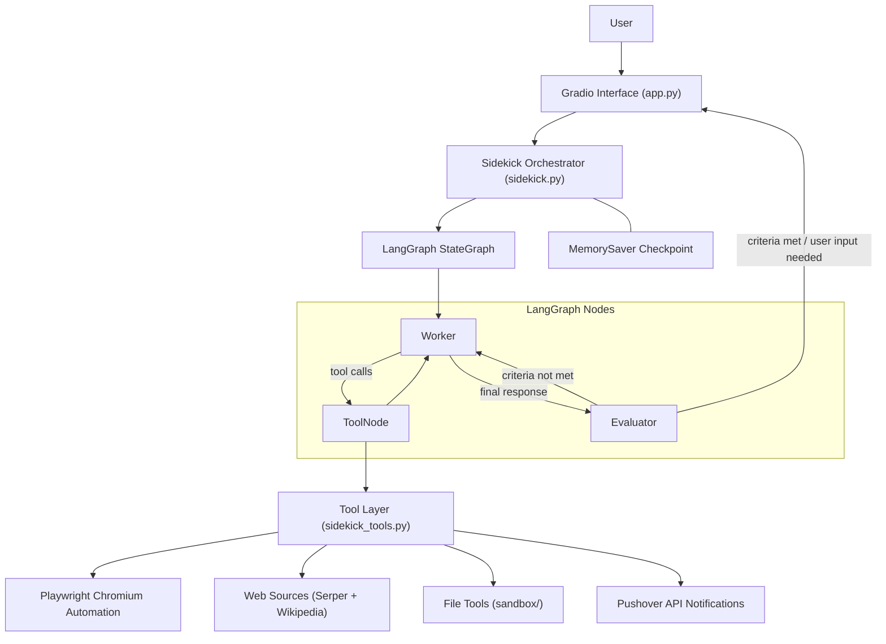
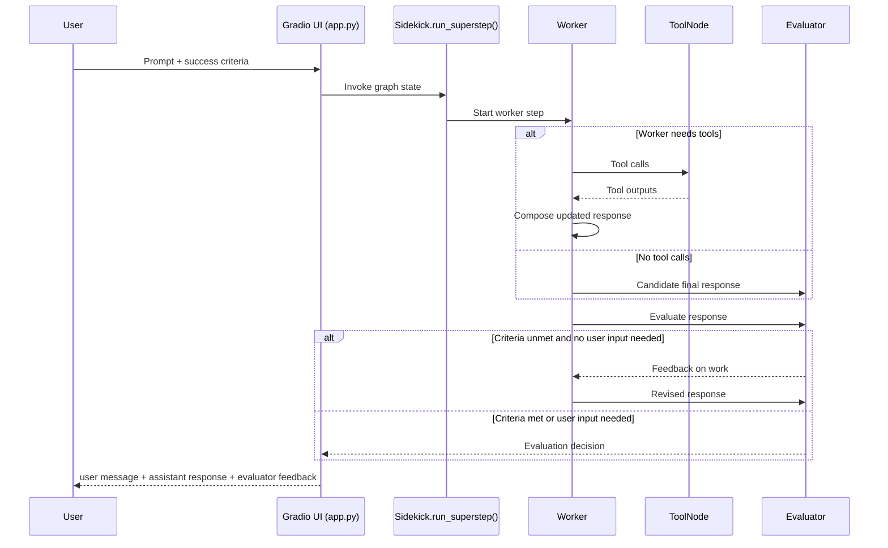
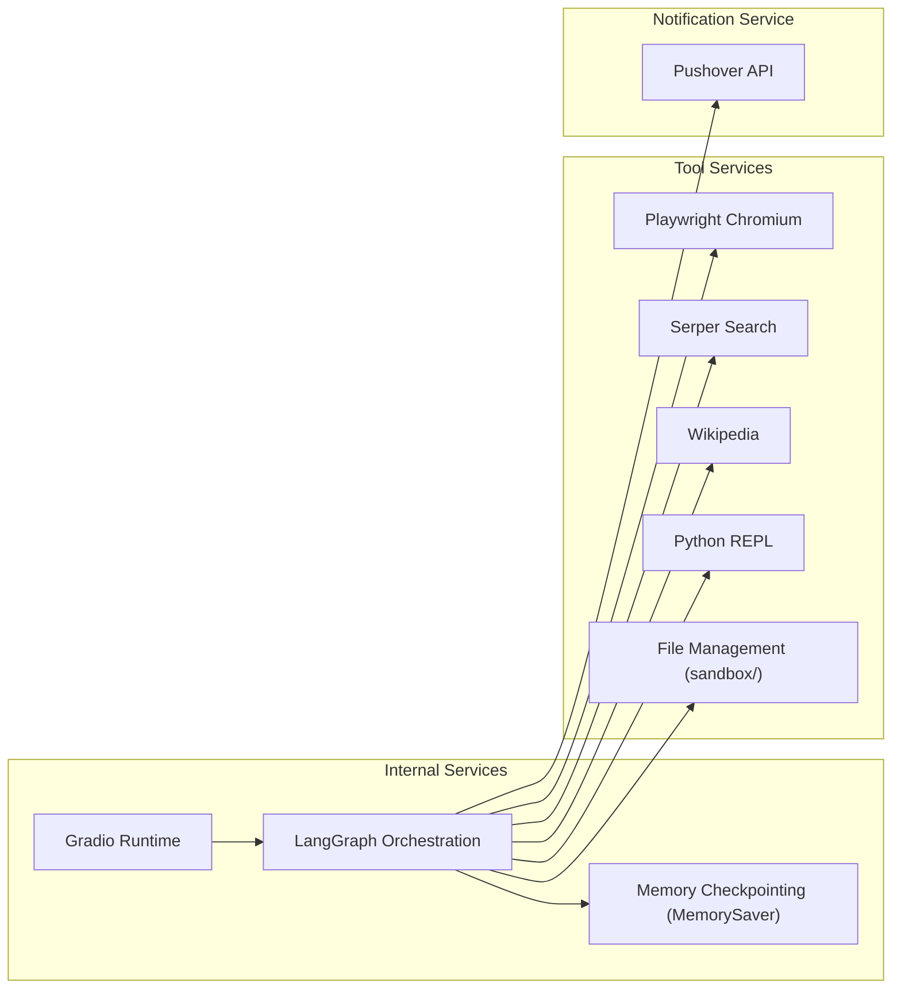

# LangGraph Autonomous Task Agent

Live demo autonomous task agent with browser automation, tool use, and an evaluator loop.

[](https://huggingface.co/spaces/cameronbell/sidekick)

## Demo GIF


_Coming soon: end-to-end demo recording of the evaluator loop and browser automation._

## Problem

Complex tasks often require repeated web navigation, tool calls, and iteration against a goal.  
Single-pass assistants are prone to stopping early, missing details, or returning outputs that do not satisfy user-defined success criteria.

## Solution

This project implements an autonomous Sidekick agent on top of LangGraph that:

- executes a worker agent with tool access
- uses Playwright for browser automation
- evaluates each assistant response against explicit success criteria
- loops until criteria are met or user input is required

## Key Features

- LangGraph state-machine orchestration (`worker -> tools -> evaluator` loop)
- Browser automation via Playwright toolkit (headless Chromium)
- Built-in tools: web search, Wikipedia, Python REPL, sandbox file management, push notifications
- Structured evaluator output with Pydantic schema (`feedback`, `success_criteria_met`, `user_input_needed`)
- Conversation memory/checkpointing per session thread ID
- Gradio chat interface for interactive runs and resets

## System Architecture



## Data Flow



## Services



## Architecture Images


_Placeholders: replace these with exported diagram PNGs for portfolio polish._

## Tech Stack

- Python 3.12
- LangGraph
- LangChain + OpenAI models
- Playwright
- Gradio
- Pydantic
- Docker (Hugging Face Spaces deployment mode)

## Demo

- Live demo target: Hugging Face Spaces (Docker SDK)
- Local run:

```bash
pip install -r requirements.txt
python app.py
```

The app serves on `0.0.0.0:7860` for HF Spaces compatibility.

## Project Structure

```text
app.py                # Gradio app entrypoint
sidekick.py           # LangGraph orchestration + evaluator loop
sidekick_tools.py     # Playwright and auxiliary tool definitions
Dockerfile            # HF Spaces Docker runtime
requirements.txt      # Runtime dependencies
sandbox/              # Writable workspace used by file tools
docs/                 # Architecture and design writeups
```

## Example Output Pattern

The chat returns:

- user message
- assistant response
- evaluator feedback on whether criteria were met

This makes autonomous iteration visible to the user on each run.

## Results

- Demonstrates evaluator-optimizer loop behavior in a production-style agent graph
- Shows end-to-end browser-enabled task execution in an HF-deployable container
- Provides a modular base for adding routing, planning, and domain-specific tools

## Technical Writeups

- [`docs/architecture.md`](docs/architecture.md)
- [`docs/design-decisions.md`](docs/design-decisions.md)
- [`docs/evaluation.md`](docs/evaluation.md)
