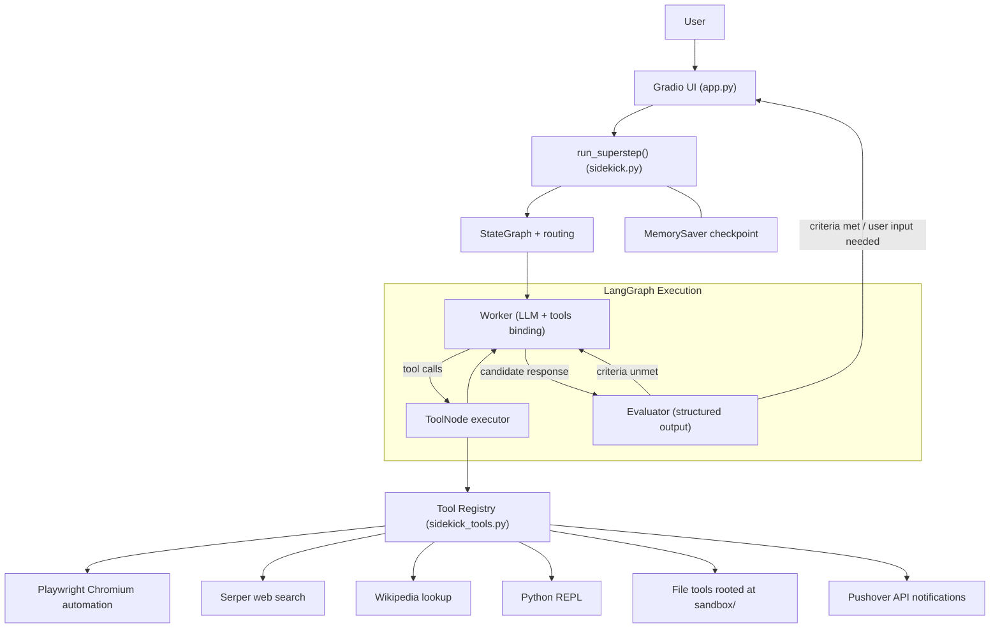
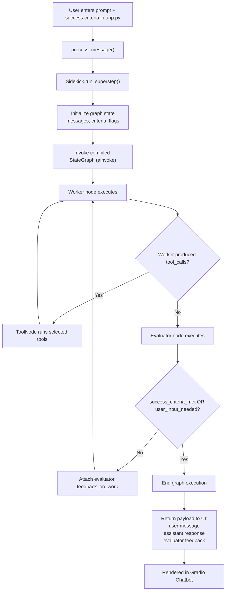
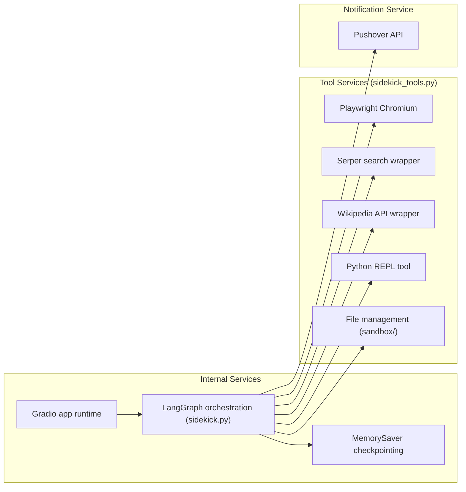

# Architecture

## Overview

The system is a LangGraph-driven autonomous task agent exposed through a Gradio chat UI.

Core flow:

1. User submits a task plus optional success criteria in `app.py`.
2. `Sidekick.run_superstep()` invokes the compiled LangGraph with task state.
3. Worker agent in `sidekick.py` decides whether to call tools or produce an answer.
4. If tools are needed, `ToolNode` executes and control returns to the worker.
5. Evaluator agent scores the latest worker answer against success criteria.
6. Graph exits when criteria are met or additional user input is required; otherwise loops back.

Core runtime files:

- `app.py`: Gradio interface and async lifecycle (`setup`, `process_message`, `reset`).
- `sidekick.py`: `Sidekick` orchestration, `StateGraph` build, routing, `MemorySaver`, evaluator loop.
- `sidekick_tools.py`: Playwright toolkit + search/wiki/python/file + Pushover notification tool.

## System Architecture

## Data Flow

## Services

## Components

- `app.py`: Async UI boundary and user interaction handling.
- `sidekick.py`: Graph state definition, nodes: worker/tool/evaluator loop, routing logic, memory checkpointing, run orchestration.
- `sidekick_tools.py`: Centralized tool loading for browser actions (Playwright browser), retrieval, computation, files, and notifications.
- `sandbox/`: Explicit root directory for file management tools (read/write operations)

## Graph Details

Nodes:

- `worker`: LLM bound to tool schemas.
- `tools`: `ToolNode` executor for tool calls.
- `evaluator`: Structured-output LLM validator.

Routing:

- `worker` -> `tools` if tool calls exist.
- `worker` -> `evaluator` if no tool calls.
- `evaluator` -> `worker` if criteria unmet and no user clarification needed.
- `evaluator` -> `END` if criteria met or user input required.

## Runtime Notes

- Playwright Chromium launches headless during setup and is cleaned up on reset/exit by `cleanup()`..
- Session continuity is managed through LangGraph `MemorySaver` with per-instance `thread_id`.
- Evaluator output (`feedback`, `success_criteria_met`, `user_input_needed`) controls graph termination and retry behavior. The Evaluator feedback is fed back into the next worker pass to improve iteration quality.
